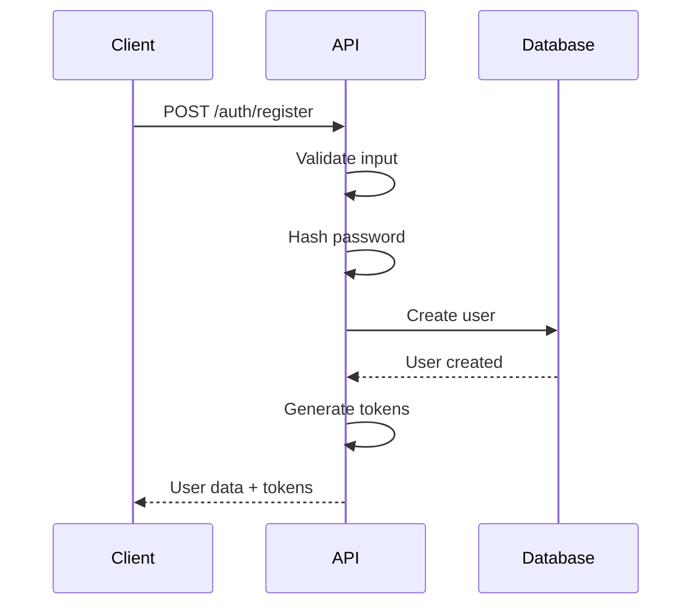
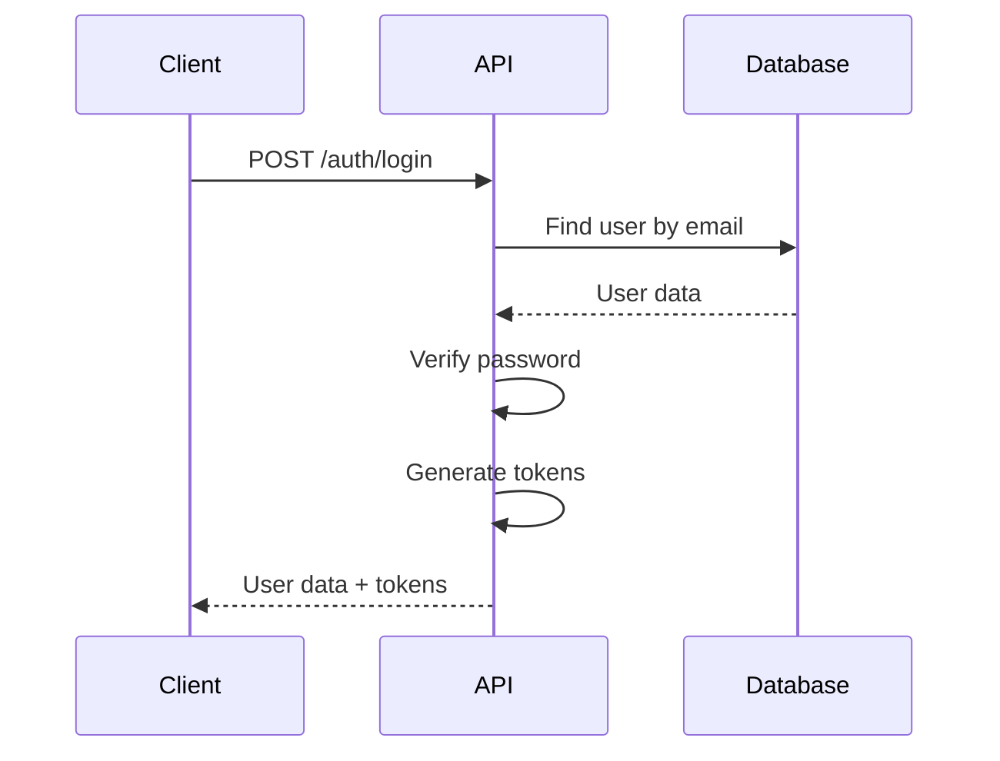
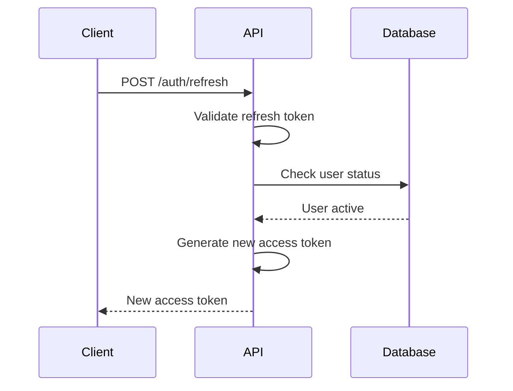

# Authentication

## Overview

Drishti uses JWT (JSON Web Tokens) for stateless authentication. The system implements a dual-token approach with access tokens for API requests and refresh tokens for token renewal.

## Authentication Flow

### Registration Flow


### Login Flow


### Token Refresh Flow


## Token Structure

### Access Token Payload
```typescript
interface AccessTokenPayload {
  sub: string;        // User ID
  email: string;      // User email
  name: string;       // User name
  role: UserRole;     // User role
  permissions: Permission[];
  iat: number;        // Issued at
  exp: number;        // Expires at
  type: 'access';
}
```

### Refresh Token Payload
```typescript
interface RefreshTokenPayload {
  sub: string;        // User ID
  iat: number;        // Issued at
  exp: number;        // Expires at
  type: 'refresh';
  jti: string;        // JWT ID for revocation
}
```

## Token Management

### Token Expiry
- **Access Token**: 24 hours (86400 seconds)
- **Refresh Token**: 7 days (604800 seconds)

### Token Storage (Mobile App)
```typescript
import * as SecureStore from 'expo-secure-store';

// Store tokens securely
const storeTokens = async (tokens: AuthTokens) => {
  await SecureStore.setItemAsync('access_token', tokens.accessToken);
  await SecureStore.setItemAsync('refresh_token', tokens.refreshToken);
};

// Retrieve tokens
const getTokens = async (): Promise<AuthTokens | null> => {
  const accessToken = await SecureStore.getItemAsync('access_token');
  const refreshToken = await SecureStore.getItemAsync('refresh_token');
  
  if (!accessToken || !refreshToken) return null;
  
  return { accessToken, refreshToken };
};
```

### Automatic Token Refresh
```typescript
// Axios interceptor for automatic token refresh
axios.interceptors.response.use(
  (response) => response,
  async (error) => {
    if (error.response?.status === 401) {
      const refreshToken = await SecureStore.getItemAsync('refresh_token');
      
      if (refreshToken) {
        try {
          const response = await axios.post('/auth/refresh', {
            refreshToken
          });
          
          const { accessToken } = response.data.data;
          await SecureStore.setItemAsync('access_token', accessToken);
          
          // Retry original request
          error.config.headers.Authorization = `Bearer ${accessToken}`;
          return axios.request(error.config);
        } catch (refreshError) {
          // Refresh failed, redirect to login
          await clearTokens();
          navigateToLogin();
        }
      }
    }
    
    return Promise.reject(error);
  }
);
```

## Authorization

### Role-Based Access Control (RBAC)
```typescript
enum UserRole {
  USER = 'user',
  ADMIN = 'admin',
  MODERATOR = 'moderator'
}

enum Permission {
  READ_OWN_DATA = 'read:own',
  WRITE_OWN_DATA = 'write:own',
  READ_ALL_DATA = 'read:all',
  WRITE_ALL_DATA = 'write:all',
  MANAGE_USERS = 'manage:users',
  MANAGE_SYSTEM = 'manage:system'
}
```

### Permission Middleware
```typescript
const requirePermission = (permission: Permission) => {
  return async (request: FastifyRequest, reply: FastifyReply) => {
    const user = request.user;
    
    if (!user.permissions.includes(permission)) {
      return reply.code(403).send({
        success: false,
        error: 'Insufficient permissions'
      });
    }
  };
};
```

## Security Best Practices

### Password Requirements
- Minimum 8 characters
- At least one uppercase letter
- At least one lowercase letter
- At least one number
- At least one special character

### Password Hashing
```typescript
import bcrypt from 'bcryptjs';

const hashPassword = async (password: string): Promise<string> => {
  const saltRounds = 12;
  return bcrypt.hash(password, saltRounds);
};

const verifyPassword = async (
  password: string, 
  hash: string
): Promise<boolean> => {
  return bcrypt.compare(password, hash);
};
```

### Token Security
- Secure HTTP-only cookies for web (future)
- Secure storage on mobile devices
- Token rotation on security events
- Blacklist for revoked tokens

## Error Handling

### Authentication Errors
```typescript
enum AuthError {
  INVALID_CREDENTIALS = 'INVALID_CREDENTIALS',
  TOKEN_EXPIRED = 'TOKEN_EXPIRED',
  TOKEN_INVALID = 'TOKEN_INVALID',
  USER_NOT_FOUND = 'USER_NOT_FOUND',
  USER_INACTIVE = 'USER_INACTIVE',
  PERMISSION_DENIED = 'PERMISSION_DENIED'
}
```

### Error Responses
```json
{
  "success": false,
  "error": "Invalid credentials",
  "code": "INVALID_CREDENTIALS",
  "timestamp": "2024-01-01T00:00:00Z"
}
```

## Rate Limiting

### Authentication Endpoints
- **Login**: 5 attempts per 15 minutes per IP
- **Register**: 3 attempts per hour per IP
- **Refresh**: 10 attempts per hour per user

### Lockout Policy
- Account lockout after 5 failed login attempts
- Lockout duration: 15 minutes
- Email notification on lockout

## Testing Authentication

### Unit Tests
```typescript
describe('Authentication', () => {
  test('should register new user', async () => {
    const response = await app.inject({
      method: 'POST',
      url: '/auth/register',
      payload: {
        email: 'test@example.com',
        name: 'Test User',
        password: 'SecurePass123!'
      }
    });
    
    expect(response.statusCode).toBe(201);
    expect(response.json().success).toBe(true);
  });
});
```

### Integration Tests
- End-to-end authentication flow
- Token refresh scenarios
- Permission-based access control
- Rate limiting validation
