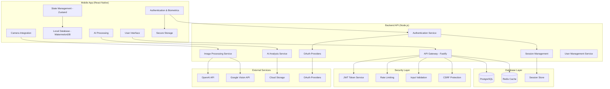
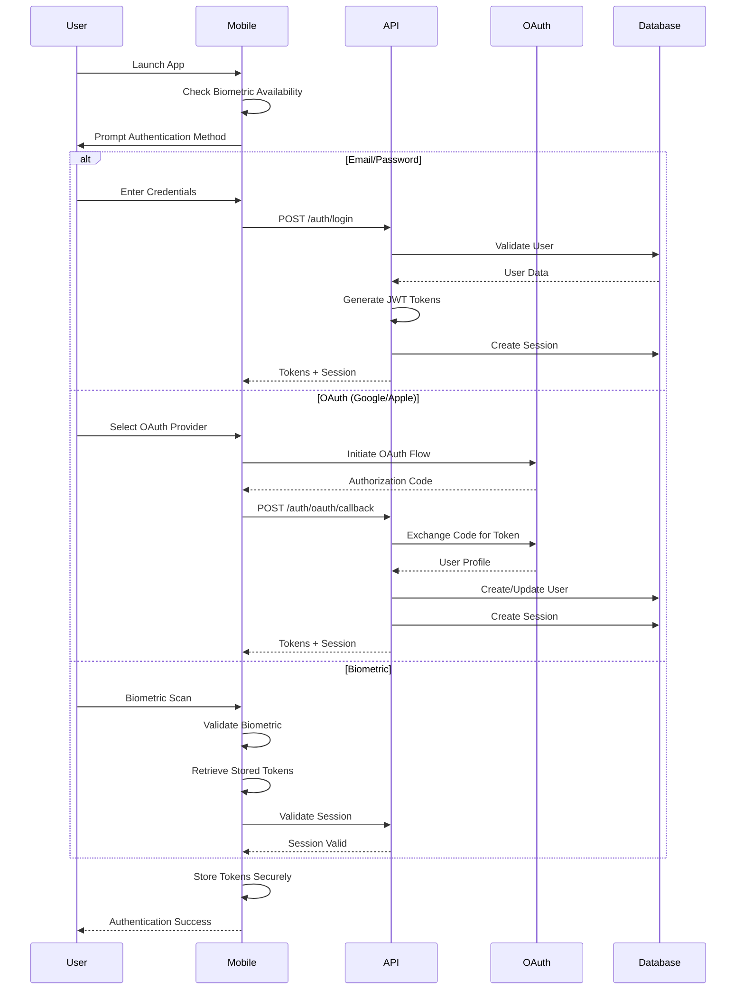
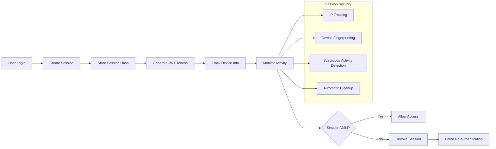

# Technical Architecture - Drishti

## System Overview

Drishti is built as a modern, scalable application using a microservices architecture with React Native for mobile and Node.js for the backend API. The system implements enterprise-grade security with multi-factor authentication, comprehensive session management, and end-to-end encryption.

## Architecture Diagram



## Authentication & Authorization Architecture

### Multi-Factor Authentication Flow


### Session Management Architecture


## Security Architecture

### Security Layers
1. **Transport Security**: TLS 1.3 encryption for all communications
2. **Authentication Security**: Multi-factor authentication with biometric support
3. **Authorization Security**: JWT-based access control with session management
4. **Data Security**: AES-256-GCM encryption for sensitive data
5. **Application Security**: Input validation, rate limiting, CSRF protection

### Security Controls Implementation
```typescript
interface SecurityControls {
  transport: {
    tls: 'TLS 1.3';
    certificatePinning: boolean;
    hsts: boolean;
  };
  authentication: {
    multiFactorAuth: boolean;
    biometricAuth: boolean;
    oauthProviders: ['google', 'apple'];
    passwordPolicy: PasswordPolicy;
  };
  authorization: {
    jwtTokens: boolean;
    sessionManagement: boolean;
    roleBasedAccess: boolean;
  };
  dataProtection: {
    encryption: 'AES-256-GCM';
    keyManagement: 'Expo SecureStore';
    dataMinimization: boolean;
  };
  applicationSecurity: {
    inputValidation: boolean;
    rateLimiting: boolean;
    csrfProtection: boolean;
    sqlInjectionPrevention: boolean;
  };
}
```

## Database Architecture

### PostgreSQL Schema Design
```sql
-- Users table with comprehensive authentication support
CREATE TABLE users (
    id UUID PRIMARY KEY DEFAULT gen_random_uuid(),
    email VARCHAR(255) UNIQUE NOT NULL,
    name VARCHAR(255) NOT NULL,
    avatar_url TEXT,
    password_hash VARCHAR(255),
    oauth_provider VARCHAR(50),
    oauth_id VARCHAR(255),
    email_verified BOOLEAN DEFAULT FALSE,
    is_active BOOLEAN DEFAULT TRUE,
    failed_login_attempts INTEGER DEFAULT 0,
    locked_until TIMESTAMP WITH TIME ZONE,
    preferences JSONB DEFAULT '{}',
    created_at TIMESTAMP WITH TIME ZONE DEFAULT NOW(),
    updated_at TIMESTAMP WITH TIME ZONE DEFAULT NOW()
);

-- Sessions table for comprehensive session management
CREATE TABLE sessions (
    id UUID PRIMARY KEY DEFAULT gen_random_uuid(),
    user_id UUID NOT NULL REFERENCES users(id) ON DELETE CASCADE,
    refresh_token_hash VARCHAR(64) NOT NULL UNIQUE,
    device_info TEXT,
    ip_address INET,
    user_agent TEXT,
    is_active BOOLEAN NOT NULL DEFAULT true,
    expires_at TIMESTAMP WITH TIME ZONE NOT NULL,
    last_activity_at TIMESTAMP WITH TIME ZONE NOT NULL DEFAULT NOW(),
    created_at TIMESTAMP WITH TIME ZONE NOT NULL DEFAULT NOW()
);
```

### Database Performance Optimization
- **Connection Pooling**: Configured for high concurrency
- **Indexing Strategy**: Optimized for authentication queries
- **Query Optimization**: Prepared statements and query analysis
- **Caching Layer**: Redis for session and frequently accessed data

## Mobile Architecture

### React Native Application Structure
```
apps/mobile/src/
├── components/          # Reusable UI components
├── screens/            # Screen components
├── navigation/         # Navigation configuration
├── services/           # Business logic services
│   ├── auth/          # Authentication services
│   ├── api/           # API communication
│   └── storage/       # Local storage management
├── hooks/             # Custom React hooks
├── utils/             # Utility functions
├── types/             # TypeScript type definitions
└── constants/         # Application constants
```

### Security Implementation
- **Biometric Authentication**: Face ID, Touch ID, Fingerprint support
- **Secure Storage**: Expo SecureStore for sensitive data
- **Certificate Pinning**: SSL certificate validation
- **Jailbreak Detection**: Device security validation
- **Code Obfuscation**: Production build protection

## API Architecture

### Fastify Backend Structure
```
apps/api/src/
├── routes/            # API route handlers
├── auth/              # Authentication system
│   ├── providers/     # OAuth providers
│   ├── jwt.ts         # JWT token management
│   ├── session.ts     # Session management
│   └── service.ts     # Authentication service
├── db/                # Database layer
│   ├── connection.ts  # Database connection
│   └── migrations/    # Database migrations
├── middleware/        # Custom middleware
├── services/          # Business logic services
└── utils/             # Utility functions
```

### Security Middleware Stack
1. **Rate Limiting**: Prevent brute force attacks
2. **Input Validation**: Joi/Zod schema validation
3. **CSRF Protection**: Cross-site request forgery prevention
4. **Security Headers**: Helmet.js security headers
5. **CORS Configuration**: Cross-origin resource sharing

## Scalability Considerations

### Horizontal Scaling
- **Stateless API Design**: JWT tokens for stateless authentication
- **Database Connection Pooling**: Efficient database resource utilization
- **Session Store**: Redis for distributed session management
- **Load Balancing**: Ready for multiple API instances

### Performance Optimization
- **Caching Strategy**: Redis for frequently accessed data
- **Database Optimization**: Proper indexing and query optimization
- **CDN Integration**: Static asset delivery optimization
- **Lazy Loading**: Mobile app performance optimization

## Monitoring & Observability

### Application Monitoring
- **Error Tracking**: Sentry integration for error monitoring
- **Performance Monitoring**: Application performance metrics
- **Security Monitoring**: Authentication and authorization events
- **Health Checks**: API and database health monitoring

### Logging Strategy
- **Structured Logging**: JSON-formatted logs for analysis
- **Security Event Logging**: Authentication and authorization events
- **Performance Logging**: Request/response timing and metrics
- **Error Logging**: Comprehensive error tracking and alerting

## Deployment Architecture

### Development Environment
- **Local Development**: Docker containers for consistency
- **Database**: Local PostgreSQL instance
- **Mobile Testing**: Expo development client
- **API Testing**: Local Fastify server

### Production Environment
- **Container Orchestration**: Docker containers
- **Database**: Managed PostgreSQL service
- **Caching**: Redis cluster
- **Load Balancing**: Application load balancer
- **SSL Termination**: TLS 1.3 encryption

## Technology Stack

### Frontend (Mobile)
- **Framework**: React Native with Expo
- **State Management**: Zustand
- **Local Database**: WatermelonDB
- **Authentication**: Expo LocalAuthentication
- **Secure Storage**: Expo SecureStore
- **Navigation**: React Navigation

### Backend (API)
- **Framework**: Node.js with Fastify
- **Database**: PostgreSQL
- **Caching**: Redis
- **Authentication**: JWT with custom session management
- **Security**: Helmet.js, Rate limiting, Input validation
- **Monitoring**: Sentry

### DevOps & Infrastructure
- **Version Control**: Git with GitHub
- **CI/CD**: GitHub Actions
- **Containerization**: Docker
- **Database Migrations**: Custom migration system
- **Environment Management**: Environment-specific configurations

## Security Compliance

### OWASP Mobile Security
- **M1-M10**: Comprehensive OWASP Mobile Top 10 compliance
- **Security Testing**: Regular penetration testing
- **Vulnerability Scanning**: Automated security scans
- **Code Review**: Security-focused code reviews

### Data Protection
- **GDPR Compliance**: European data protection regulation
- **CCPA Compliance**: California consumer privacy act
- **Data Minimization**: Collect only necessary data
- **Right to Deletion**: User data deletion capabilities

This architecture provides a robust, secure, and scalable foundation for the Drishti application with enterprise-grade authentication and authorization capabilities.
