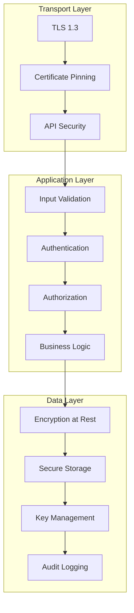

# Epic 5: User Onboarding & Profile Management - Security Guide

## Overview

This document provides comprehensive security documentation for Epic 5, covering security architecture, threat modeling, implementation details, compliance measures, and security testing procedures.

## Security Architecture

### Security Layers



### Security Principles

1. **Defense in Depth**: Multiple security layers protect against various attack vectors
2. **Least Privilege**: Users and systems have minimal necessary permissions
3. **Zero Trust**: No implicit trust, verify everything
4. **Privacy by Design**: Privacy considerations built into every feature
5. **Secure by Default**: Secure configurations are the default settings

## Threat Model

### Assets

**Primary Assets:**
- User personal information (PII)
- Financial data (income, savings, investments)
- Authentication credentials
- Profile pictures and metadata
- ML recommendation data

**Secondary Assets:**
- Application code
- Configuration data
- Audit logs
- Analytics data

### Threat Actors

**External Threats:**
- Cybercriminals seeking financial data
- Identity thieves targeting PII
- Competitors seeking business intelligence
- Nation-state actors (advanced persistent threats)

**Internal Threats:**
- Malicious insiders
- Compromised developer accounts
- Third-party service providers

### Attack Vectors

**Network-based Attacks:**
- Man-in-the-middle attacks
- API endpoint exploitation
- Certificate spoofing
- DNS poisoning

**Application-based Attacks:**
- SQL injection
- Cross-site scripting (XSS)
- Authentication bypass
- Session hijacking
- File upload vulnerabilities

**Device-based Attacks:**
- Malware installation
- Physical device access
- Jailbreak/root exploitation
- Side-channel attacks

## Security Implementation

### Authentication & Authorization

#### Multi-Factor Authentication (MFA)

```typescript
class MFAService {
  /**
   * Enable two-factor authentication for user
   */
  async enableTwoFactor(userId: string): Promise<TwoFactorSetup> {
    // Generate secret key
    const secret = speakeasy.generateSecret({
      name: `Drishti (${userId})`,
      issuer: 'Drishti FIRE App',
      length: 32
    });

    // Store encrypted secret
    await this.storeEncryptedSecret(userId, secret.base32);

    // Generate QR code
    const qrCodeUrl = await QRCode.toDataURL(secret.otpauth_url);

    // Generate backup codes
    const backupCodes = this.generateBackupCodes();
    await this.storeEncryptedBackupCodes(userId, backupCodes);

    return {
      secret: secret.base32,
      qrCode: qrCodeUrl,
      backupCodes,
      manualEntryKey: secret.base32
    };
  }

  /**
   * Verify TOTP token
   */
  async verifyTOTP(userId: string, token: string): Promise<boolean> {
    const secret = await this.getDecryptedSecret(userId);
    
    return speakeasy.totp.verify({
      secret,
      token,
      window: 2, // Allow 2 time steps (60 seconds) tolerance
      encoding: 'base32'
    });
  }

  /**
   * Generate secure backup codes
   */
  private generateBackupCodes(): string[] {
    const codes: string[] = [];
    for (let i = 0; i < 10; i++) {
      codes.push(crypto.randomBytes(4).toString('hex').toUpperCase());
    }
    return codes;
  }
}
```

#### Biometric Authentication

```typescript
class BiometricAuthService {
  /**
   * Enable biometric authentication
   */
  async enableBiometric(): Promise<BiometricSetupResult> {
    // Check device capability
    const isAvailable = await LocalAuthentication.hasHardwareAsync();
    if (!isAvailable) {
      throw new Error('Biometric hardware not available');
    }

    // Check enrolled biometrics
    const isEnrolled = await LocalAuthentication.isEnrolledAsync();
    if (!isEnrolled) {
      throw new Error('No biometrics enrolled on device');
    }

    // Get supported types
    const supportedTypes = await LocalAuthentication.supportedAuthenticationTypesAsync();
    
    return {
      available: true,
      enrolled: true,
      supportedTypes: supportedTypes.map(type => ({
        type,
        name: this.getBiometricTypeName(type)
      }))
    };
  }

  /**
   * Authenticate with biometrics
   */
  async authenticate(reason: string): Promise<AuthenticationResult> {
    const result = await LocalAuthentication.authenticateAsync({
      promptMessage: reason,
      cancelLabel: 'Cancel',
      fallbackLabel: 'Use PIN',
      disableDeviceFallback: false
    });

    if (result.success) {
      // Log successful authentication
      await SecurityEventLogger.log({
        type: 'biometric_auth_success',
        userId: await this.getCurrentUserId(),
        metadata: {
          biometricType: result.biometryType,
          timestamp: Date.now()
        }
      });
    } else {
      // Log failed authentication
      await SecurityEventLogger.log({
        type: 'biometric_auth_failure',
        userId: await this.getCurrentUserId(),
        metadata: {
          error: result.error,
          timestamp: Date.now()
        }
      });
    }

    return result;
  }
}
```

### Data Encryption

#### Encryption Service

```typescript
class EncryptionService {
  private readonly ALGORITHM = 'aes-256-gcm';
  private readonly KEY_LENGTH = 32;
  private readonly IV_LENGTH = 16;
  private readonly TAG_LENGTH = 16;

  /**
   * Encrypt sensitive data
   */
  async encrypt(plaintext: string, userKey?: string): Promise<EncryptedData> {
    try {
      // Generate or derive encryption key
      const key = userKey ? 
        await this.deriveKey(userKey) : 
        await this.getOrCreateMasterKey();

      // Generate random IV
      const iv = crypto.randomBytes(this.IV_LENGTH);

      // Create cipher
      const cipher = crypto.createCipher(this.ALGORITHM, key);
      cipher.setAAD(Buffer.from('drishti-app'));

      // Encrypt data
      let encrypted = cipher.update(plaintext, 'utf8', 'hex');
      encrypted += cipher.final('hex');

      // Get authentication tag
      const tag = cipher.getAuthTag();

      return {
        encrypted,
        iv: iv.toString('hex'),
        tag: tag.toString('hex'),
        algorithm: this.ALGORITHM
      };
    } catch (error) {
      throw new Error(`Encryption failed: ${error.message}`);
    }
  }

  /**
   * Decrypt sensitive data
   */
  async decrypt(encryptedData: EncryptedData, userKey?: string): Promise<string> {
    try {
      // Get decryption key
      const key = userKey ? 
        await this.deriveKey(userKey) : 
        await this.getMasterKey();

      // Create decipher
      const decipher = crypto.createDecipher(
        encryptedData.algorithm, 
        key
      );
      
      decipher.setAAD(Buffer.from('drishti-app'));
      decipher.setAuthTag(Buffer.from(encryptedData.tag, 'hex'));

      // Decrypt data
      let decrypted = decipher.update(encryptedData.encrypted, 'hex', 'utf8');
      decrypted += decipher.final('utf8');

      return decrypted;
    } catch (error) {
      throw new Error(`Decryption failed: ${error.message}`);
    }
  }

  /**
   * Derive key from user password using PBKDF2
   */
  private async deriveKey(password: string): Promise<Buffer> {
    const salt = await this.getUserSalt();
    return crypto.pbkdf2Sync(password, salt, 100000, this.KEY_LENGTH, 'sha256');
  }

  /**
   * Get or create master encryption key
   */
  private async getOrCreateMasterKey(): Promise<Buffer> {
    let key = await SecureStore.getItemAsync('master_key');
    
    if (!key) {
      key = crypto.randomBytes(this.KEY_LENGTH).toString('hex');
      await SecureStore.setItemAsync('master_key', key);
    }
    
    return Buffer.from(key, 'hex');
  }
}
```

### Secure File Storage

#### Photo Security

```typescript
class SecurePhotoStorage {
  private encryptionService = new EncryptionService();

  /**
   * Store photo securely with encryption
   */
  async storePhoto(photoUri: string, userId: string): Promise<SecurePhotoResult> {
    try {
      // Read photo data
      const photoData = await FileSystem.readAsStringAsync(photoUri, {
        encoding: FileSystem.EncodingType.Base64
      });

      // Encrypt photo data
      const encrypted = await this.encryptionService.encrypt(photoData, userId);

      // Generate secure filename
      const filename = `${crypto.randomUUID()}.enc`;
      const secureDir = `${FileSystem.documentDirectory}secure_photos/`;

      // Ensure directory exists
      await FileSystem.makeDirectoryAsync(secureDir, { intermediates: true });

      // Store encrypted photo
      const securePath = `${secureDir}${filename}`;
      await FileSystem.writeAsStringAsync(
        securePath,
        JSON.stringify(encrypted),
        { encoding: FileSystem.EncodingType.UTF8 }
      );

      // Store metadata
      const metadata = {
        originalUri: photoUri,
        securePath,
        filename,
        encryptedAt: Date.now(),
        userId
      };

      await this.storePhotoMetadata(userId, metadata);

      return {
        success: true,
        securePath,
        metadata
      };
    } catch (error) {
      throw new Error(`Secure photo storage failed: ${error.message}`);
    }
  }

  /**
   * Retrieve and decrypt photo
   */
  async retrievePhoto(userId: string, filename: string): Promise<string> {
    try {
      const secureDir = `${FileSystem.documentDirectory}secure_photos/`;
      const securePath = `${secureDir}${filename}`;

      // Read encrypted data
      const encryptedData = await FileSystem.readAsStringAsync(securePath);
      const encrypted = JSON.parse(encryptedData);

      // Decrypt photo data
      const decrypted = await this.encryptionService.decrypt(encrypted, userId);

      // Create temporary file for display
      const tempPath = `${FileSystem.cacheDirectory}temp_${Date.now()}.jpg`;
      await FileSystem.writeAsStringAsync(tempPath, decrypted, {
        encoding: FileSystem.EncodingType.Base64
      });

      return tempPath;
    } catch (error) {
      throw new Error(`Photo retrieval failed: ${error.message}`);
    }
  }

  /**
   * Securely delete photo
   */
  async deletePhoto(userId: string, filename: string): Promise<void> {
    try {
      const secureDir = `${FileSystem.documentDirectory}secure_photos/`;
      const securePath = `${secureDir}${filename}`;

      // Overwrite file with random data before deletion
      const randomData = crypto.randomBytes(1024 * 1024).toString('hex'); // 1MB random data
      await FileSystem.writeAsStringAsync(securePath, randomData);
      
      // Delete file
      await FileSystem.deleteAsync(securePath);

      // Remove metadata
      await this.removePhotoMetadata(userId, filename);

      // Log secure deletion
      await SecurityEventLogger.log({
        type: 'secure_photo_deletion',
        userId,
        metadata: { filename, timestamp: Date.now() }
      });
    } catch (error) {
      throw new Error(`Secure photo deletion failed: ${error.message}`);
    }
  }
}
```

### Privacy Controls

#### Privacy Dashboard Security

```typescript
class PrivacySecurityService {
  /**
   * Validate privacy setting changes
   */
  async validatePrivacyChange(
    userId: string,
    setting: string,
    newValue: boolean,
    userConsent: boolean
  ): Promise<PrivacyValidationResult> {
    // Verify user consent for sensitive changes
    if (this.isSensitiveSetting(setting) && !userConsent) {
      throw new Error('User consent required for sensitive privacy changes');
    }

    // Check for required settings that cannot be disabled
    if (this.isRequiredSetting(setting) && !newValue) {
      throw new Error('Required privacy setting cannot be disabled');
    }

    // Log privacy setting change
    await SecurityEventLogger.log({
      type: 'privacy_setting_change',
      userId,
      metadata: {
        setting,
        oldValue: await this.getCurrentSetting(userId, setting),
        newValue,
        timestamp: Date.now(),
        userConsent
      }
    });

    return {
      valid: true,
      requiresRestart: this.requiresAppRestart(setting),
      impactedFeatures: this.getImpactedFeatures(setting)
    };
  }

  /**
   * Generate privacy audit report
   */
  async generatePrivacyAudit(userId: string): Promise<PrivacyAuditReport> {
    const settings = await this.getAllPrivacySettings(userId);
    const dataCollection = await this.getDataCollectionInfo(userId);
    const thirdPartySharing = await this.getThirdPartySharing(userId);
    const dataRetention = await this.getDataRetentionInfo(userId);

    return {
      userId,
      generatedAt: Date.now(),
      privacyScore: this.calculatePrivacyScore(settings),
      settings,
      dataCollection,
      thirdPartySharing,
      dataRetention,
      recommendations: this.generatePrivacyRecommendations(settings)
    };
  }
}
```

### Security Event Logging

#### Audit Trail Implementation

```typescript
class SecurityEventLogger {
  /**
   * Log security event with encryption
   */
  static async log(event: SecurityEvent): Promise<void> {
    try {
      // Enrich event with context
      const enrichedEvent = {
        ...event,
        id: crypto.randomUUID(),
        timestamp: Date.now(),
        deviceInfo: await this.getDeviceInfo(),
        appVersion: await this.getAppVersion(),
        sessionId: await this.getSessionId()
      };

      // Encrypt sensitive event data
      const encryptedEvent = await this.encryptEventData(enrichedEvent);

      // Store in secure audit log
      await this.storeAuditEvent(encryptedEvent);

      // Send to security monitoring (if enabled)
      if (this.isSecurityMonitoringEnabled()) {
        await this.sendToSecurityMonitoring(enrichedEvent);
      }
    } catch (error) {
      console.error('Security event logging failed:', error);
      // Fail silently to not impact user experience
    }
  }

  /**
   * Query security events with access control
   */
  static async queryEvents(
    userId: string,
    filters: SecurityEventFilters,
    requesterRole: string
  ): Promise<SecurityEvent[]> {
    // Verify access permissions
    if (!this.hasAuditAccess(requesterRole)) {
      throw new Error('Insufficient permissions for audit log access');
    }

    // Apply filters and retrieve events
    const events = await this.retrieveAuditEvents(userId, filters);

    // Decrypt and sanitize events based on requester role
    return this.sanitizeEventsForRole(events, requesterRole);
  }

  /**
   * Detect anomalous security events
   */
  static async detectAnomalies(userId: string): Promise<SecurityAnomaly[]> {
    const recentEvents = await this.getRecentEvents(userId, 24 * 60 * 60 * 1000); // 24 hours
    const anomalies: SecurityAnomaly[] = [];

    // Check for unusual login patterns
    const loginEvents = recentEvents.filter(e => e.type.includes('auth'));
    if (this.hasUnusualLoginPattern(loginEvents)) {
      anomalies.push({
        type: 'unusual_login_pattern',
        severity: 'medium',
        description: 'Unusual login times or locations detected',
        events: loginEvents
      });
    }

    // Check for rapid profile changes
    const profileEvents = recentEvents.filter(e => e.type.includes('profile'));
    if (this.hasRapidProfileChanges(profileEvents)) {
      anomalies.push({
        type: 'rapid_profile_changes',
        severity: 'high',
        description: 'Multiple profile changes in short time period',
        events: profileEvents
      });
    }

    return anomalies;
  }
}
```

## Compliance & Standards

### GDPR Compliance

#### Data Subject Rights Implementation

```typescript
class GDPRComplianceService {
  /**
   * Handle data portability request (Article 20)
   */
  async exportUserData(userId: string, format: 'json' | 'csv'): Promise<DataExportResult> {
    // Verify user identity
    await this.verifyUserIdentity(userId);

    // Collect all user data
    const userData = await this.collectAllUserData(userId);

    // Encrypt export data
    const encryptedData = await this.encryptExportData(userData);

    // Generate secure download link
    const downloadLink = await this.generateSecureDownloadLink(encryptedData);

    // Log data export request
    await SecurityEventLogger.log({
      type: 'gdpr_data_export',
      userId,
      metadata: {
        format,
        dataSize: encryptedData.length,
        timestamp: Date.now()
      }
    });

    return {
      downloadLink,
      expiresAt: Date.now() + (24 * 60 * 60 * 1000), // 24 hours
      format,
      estimatedSize: encryptedData.length
    };
  }

  /**
   * Handle right to erasure request (Article 17)
   */
  async deleteUserData(userId: string, reason: string): Promise<DeletionResult> {
    // Verify user identity and consent
    await this.verifyUserIdentityAndConsent(userId);

    // Check for legal obligations to retain data
    const retentionRequirements = await this.checkRetentionRequirements(userId);
    
    if (retentionRequirements.mustRetain) {
      throw new Error(`Data cannot be deleted: ${retentionRequirements.reason}`);
    }

    // Perform secure data deletion
    const deletionResults = await this.performSecureDataDeletion(userId);

    // Log data deletion
    await SecurityEventLogger.log({
      type: 'gdpr_data_deletion',
      userId,
      metadata: {
        reason,
        deletedRecords: deletionResults.recordCount,
        timestamp: Date.now()
      }
    });

    return deletionResults;
  }
}
```

### Security Standards Compliance

#### OWASP Mobile Top 10 Mitigation

1. **M1: Improper Platform Usage**
   - Proper use of iOS/Android security features
   - Secure keychain/keystore usage
   - Proper permission handling

2. **M2: Insecure Data Storage**
   - AES-256-GCM encryption for sensitive data
   - Secure storage using Expo SecureStore
   - No sensitive data in logs or temporary files

3. **M3: Insecure Communication**
   - TLS 1.3 for all network communications
   - Certificate pinning implementation
   - No sensitive data in URLs

4. **M4: Insecure Authentication**
   - Multi-factor authentication support
   - Biometric authentication integration
   - Secure session management

5. **M5: Insufficient Cryptography**
   - Industry-standard encryption algorithms
   - Proper key management
   - Secure random number generation

## Security Testing

### Penetration Testing Checklist

```typescript
// Security test cases for Epic 5
describe('Security Tests', () => {
  describe('Authentication Security', () => {
    it('should prevent brute force attacks', async () => {
      const attempts = [];
      for (let i = 0; i < 10; i++) {
        attempts.push(attemptLogin('user@test.com', 'wrong-password'));
      }
      
      await Promise.all(attempts);
      
      // Should be rate limited after 5 attempts
      const result = await attemptLogin('user@test.com', 'wrong-password');
      expect(result.error).toBe('RATE_LIMITED');
    });

    it('should invalidate sessions on suspicious activity', async () => {
      const session = await createTestSession();
      
      // Simulate suspicious activity
      await simulateSuspiciousActivity(session.userId);
      
      // Session should be invalidated
      const result = await makeAuthenticatedRequest(session.token);
      expect(result.error).toBe('SESSION_INVALIDATED');
    });
  });

  describe('Data Encryption', () => {
    it('should encrypt sensitive profile data', async () => {
      const sensitiveData = 'user@test.com';
      const encrypted = await EncryptionService.encrypt(sensitiveData);
      
      expect(encrypted.encrypted).not.toBe(sensitiveData);
      expect(encrypted.iv).toBeDefined();
      expect(encrypted.tag).toBeDefined();
      
      const decrypted = await EncryptionService.decrypt(encrypted);
      expect(decrypted).toBe(sensitiveData);
    });
  });

  describe('Privacy Controls', () => {
    it('should respect data collection preferences', async () => {
      await updatePrivacySetting('analytics', false);
      
      // Analytics should not be collected
      const events = await getAnalyticsEvents();
      expect(events).toHaveLength(0);
    });
  });
});
```

This comprehensive security guide ensures Epic 5 meets the highest security standards with robust protection for user data and privacy.
