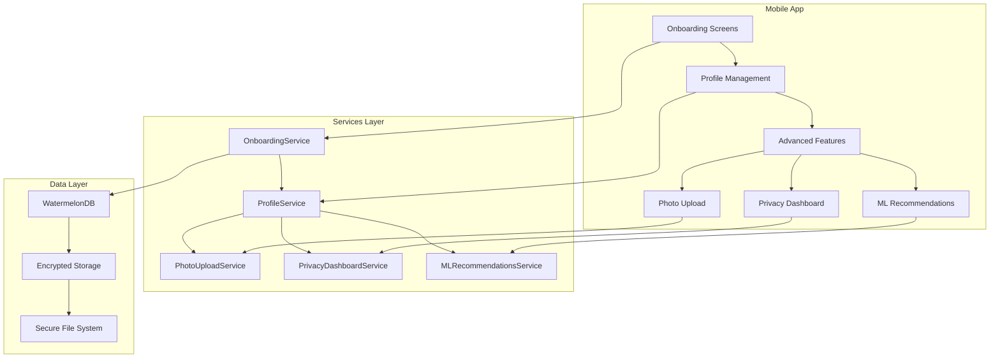
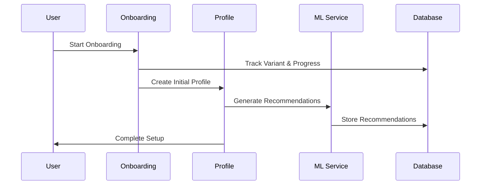

# Epic 5: User Onboarding & Profile Management - Technical Implementation Guide

## Overview

This technical guide provides comprehensive documentation for the user onboarding and profile management system implementation, including architecture decisions, code organization, API specifications, and deployment procedures.

## Architecture Overview

### System Architecture



### Data Flow Architecture



## Database Schema

### Enhanced Profile Schema

```typescript
interface UserProfile {
  // Core fields
  id: string;
  personalInfo: PersonalInformation;
  financialInfo: FinancialInformation;
  regionalSettings: RegionalSettings;
  securitySettings: SecuritySettings;
  privacySettings: PrivacySettings;
  
  // Advanced fields
  onboardingVariant?: OnboardingVariant;
  profilePictureMetadata?: ProfilePictureMetadata;
  twoFactorEnabled?: boolean;
  twoFactorBackupCodes?: string[];
  
  // Audit fields
  securityEvents: SecurityEvent[];
  changeHistory: ProfileChangeHistory[];
  createdAt: number;
  updatedAt: number;
  version: number;
}
```

### Onboarding Schema

```typescript
interface OnboardingVariant {
  id: string;
  userId: string;
  variant: 'beginner' | 'intermediate' | 'advanced';
  currentStep: number;
  totalSteps: number;
  completedSteps: number[];
  startedAt: number;
  completedAt?: number;
  analytics: OnboardingAnalytics;
}

interface OnboardingAnalytics {
  timeSpentPerStep: Record<number, number>;
  interactionEvents: InteractionEvent[];
  completionRate: number;
  dropOffPoints: number[];
}
```

### ML Recommendations Schema

```typescript
interface PersonalizedRecommendation {
  id: string;
  type: RecommendationType;
  title: string;
  description: string;
  rationale: string;
  actionSteps: string[];
  impact: RecommendationImpact;
  priority: 'low' | 'medium' | 'high';
  confidence: number;
  mlScore?: number;
  peerComparison?: PeerComparison;
  marketConditions?: MarketConditionData;
  implementationTracking?: ImplementationTracking;
  createdAt: number;
  expiresAt?: number;
}
```

## Service Layer Implementation

### OnboardingService

```typescript
class OnboardingService {
  /**
   * Initialize onboarding with variant selection
   */
  async initializeOnboarding(
    userId: string, 
    variant: OnboardingVariantType
  ): Promise<OnboardingVariant> {
    const onboardingData: OnboardingVariant = {
      id: generateId(),
      userId,
      variant,
      currentStep: 0,
      totalSteps: this.getStepsForVariant(variant),
      completedSteps: [],
      startedAt: Date.now(),
      analytics: {
        timeSpentPerStep: {},
        interactionEvents: [],
        completionRate: 0,
        dropOffPoints: [],
      },
    };

    await this.saveOnboardingData(onboardingData);
    return onboardingData;
  }

  /**
   * Track step completion with analytics
   */
  async completeStep(
    userId: string, 
    stepNumber: number, 
    timeSpent: number
  ): Promise<void> {
    const onboarding = await this.getOnboardingData(userId);
    if (!onboarding) return;

    onboarding.completedSteps.push(stepNumber);
    onboarding.currentStep = stepNumber + 1;
    onboarding.analytics.timeSpentPerStep[stepNumber] = timeSpent;
    onboarding.analytics.completionRate = 
      onboarding.completedSteps.length / onboarding.totalSteps;

    await this.saveOnboardingData(onboarding);
  }
}
```

### ProfileService Enhanced

```typescript
class ProfileService {
  /**
   * Update profile with change tracking
   */
  async updateProfile(
    userId: string,
    updates: Partial<UserProfile>,
    reason?: string
  ): Promise<UserProfile> {
    const currentProfile = await this.getProfile(userId);
    if (!currentProfile) {
      throw new Error('Profile not found');
    }

    // Track changes
    const changes = this.detectChanges(currentProfile, updates);
    const changeHistory: ProfileChangeHistory = {
      id: generateId(),
      userId,
      changes,
      timestamp: Date.now(),
      reason,
      deviceInfo: await this.getDeviceInfo(),
    };

    // Apply updates
    const updatedProfile = {
      ...currentProfile,
      ...updates,
      updatedAt: Date.now(),
      version: currentProfile.version + 1,
    };

    // Save profile and history
    await this.saveProfile(updatedProfile);
    await this.saveChangeHistory(changeHistory);

    return updatedProfile;
  }

  /**
   * Calculate security score
   */
  calculateSecurityScore(profile: UserProfile): number {
    let score = 0;
    const weights = {
      twoFactor: 30,
      biometric: 25,
      strongPassword: 20,
      profileComplete: 15,
      recentActivity: 10,
    };

    if (profile.securitySettings.twoFactorEnabled) {
      score += weights.twoFactor;
    }

    if (profile.securitySettings.biometricEnabled) {
      score += weights.biometric;
    }

    // Additional scoring logic...
    return Math.min(100, score);
  }
}
```

### PhotoUploadService

```typescript
class PhotoUploadService {
  /**
   * Process and compress image
   */
  async processImage(
    uri: string,
    options: PhotoUploadOptions
  ): Promise<PhotoUploadResult> {
    try {
      // Get original file info
      const originalInfo = await FileSystem.getInfoAsync(uri);
      const originalSize = originalInfo.exists ? originalInfo.size || 0 : 0;

      // Compress and resize
      const manipulatedImage = await ImageManipulator.manipulateAsync(
        uri,
        [{ resize: { width: options.maxWidth, height: options.maxHeight } }],
        {
          compress: options.quality,
          format: this.getImageFormat(options.format),
          base64: true,
        }
      );

      // Create metadata
      const metadata: ProfilePictureMetadata = {
        originalSize,
        compressedSize: manipulatedImage.width * manipulatedImage.height * 3, // Estimate
        dimensions: {
          width: manipulatedImage.width,
          height: manipulatedImage.height,
        },
        uploadedAt: Date.now(),
        format: options.format,
      };

      return {
        uri: manipulatedImage.uri,
        base64: manipulatedImage.base64,
        metadata,
        success: true,
      };
    } catch (error) {
      return {
        uri: '',
        metadata: this.createEmptyMetadata(),
        success: false,
        error: error instanceof Error ? error.message : 'Processing failed',
      };
    }
  }
}
```

### PrivacyDashboardService

```typescript
class PrivacyDashboardService {
  /**
   * Get privacy dashboard with current settings
   */
  async getDashboard(): Promise<PrivacyDashboard> {
    const dashboard = await this.loadDashboard();
    return dashboard || this.createDefaultDashboard();
  }

  /**
   * Calculate privacy score
   */
  getPrivacyScore(): number {
    if (!this.currentDashboard) return 0;

    const weights = {
      dataCollection: 40,
      thirdPartySharing: 35,
      userRights: 25,
    };

    // Data collection score (higher for fewer enabled optional items)
    const dataCollection = this.currentDashboard.dataCollected;
    const optionalItems = dataCollection.filter(d => !d.required);
    const enabledOptional = optionalItems.filter(d => d.enabled);
    const dataScore = optionalItems.length > 0 
      ? ((optionalItems.length - enabledOptional.length) / optionalItems.length) * weights.dataCollection
      : weights.dataCollection;

    // Calculate total score
    return Math.round(dataScore + /* other calculations */);
  }
}
```

### MLRecommendationsService

```typescript
class MLRecommendationsService {
  /**
   * Generate advanced ML recommendations
   */
  async generateAdvancedRecommendations(
    profile: UserProfile
  ): Promise<PersonalizedRecommendation[]> {
    const recommendations: PersonalizedRecommendation[] = [];
    const financial = profile.financialInfo;

    // Get peer comparison data
    const peerComparison = await this.generatePeerComparison(profile);
    
    // Get market conditions
    const marketConditions = await this.getMarketConditions();

    // ML-powered savings rate optimization
    if (financial.savingsRate < 0.5) {
      const mlScore = this.calculateMLScore(profile, 'savings_rate');
      recommendations.push({
        id: `ml_savings_${Date.now()}`,
        type: 'savings_rate',
        title: 'AI-Optimized Savings Strategy',
        description: `Our ML model suggests increasing your savings rate to ${Math.round((financial.savingsRate + 0.1) * 100)}%.`,
        rationale: 'Machine learning analysis of similar profiles shows this adjustment optimizes your FIRE timeline.',
        actionSteps: [
          'Analyze spending patterns using AI insights',
          'Implement automated savings increases',
          'Track progress with ML-powered monitoring',
        ],
        impact: {
          timeToFire: financial.yearsToFire * 0.75,
          additionalSavings: financial.totalAnnualIncome * 0.1,
          confidenceIncrease: 0.15,
        },
        priority: 'high',
        confidence: 0.88,
        mlScore,
        peerComparison,
        marketConditions,
        createdAt: Date.now(),
        implementationTracking: this.createImplementationTracking('savings_optimization'),
      });
    }

    return recommendations;
  }

  /**
   * Calculate ML confidence score
   */
  private calculateMLScore(profile: UserProfile, type: string): number {
    const features = this.extractFeatures(profile);
    const baseScore = this.mlModel.accuracy;
    const completeness = this.calculateDataCompleteness(profile);
    const adjustedScore = baseScore * completeness;
    const variance = (Math.random() - 0.5) * 0.1;
    
    return Math.max(0.5, Math.min(1.0, adjustedScore + variance));
  }
}
```

## Component Architecture

### Screen Components

#### OnboardingScreen

```typescript
const OnboardingScreen: React.FC<OnboardingScreenProps> = ({ 
  variant, 
  step, 
  onComplete 
}) => {
  const [progress, setProgress] = useState(0);
  const { trackEvent } = useAnalytics();

  const handleStepComplete = async () => {
    await trackEvent('onboarding_step_complete', {
      variant,
      step,
      timeSpent: Date.now() - startTime,
    });
    
    onComplete();
  };

  return (
    <SafeAreaView style={styles.container}>
      <OnboardingProgress 
        currentStep={step} 
        totalSteps={getTotalSteps(variant)} 
      />
      
      {renderStepContent(variant, step)}
      
      <Button onPress={handleStepComplete}>
        Continue
      </Button>
    </SafeAreaView>
  );
};
```

#### PrivacyDashboardScreen

```typescript
const PrivacyDashboardScreen: React.FC = () => {
  const [dashboard, setDashboard] = useState<PrivacyDashboard | null>(null);
  const [privacyScore, setPrivacyScore] = useState(0);

  useEffect(() => {
    loadDashboard();
  }, []);

  const loadDashboard = async () => {
    const data = await PrivacyDashboardService.getDashboard();
    setDashboard(data);
    setPrivacyScore(PrivacyDashboardService.getPrivacyScore());
  };

  return (
    <ScrollView>
      <PrivacyScoreCard score={privacyScore} />
      <DataCollectionControls 
        data={dashboard?.dataCollected} 
        onUpdate={handleDataCollectionUpdate}
      />
      <ThirdPartyControls 
        partners={dashboard?.thirdPartySharing}
        onUpdate={handleThirdPartyUpdate}
      />
    </ScrollView>
  );
};
```

## Testing Strategy

### Unit Testing

```typescript
describe('ProfileService', () => {
  let profileService: ProfileService;
  
  beforeEach(() => {
    profileService = new ProfileService();
  });

  describe('updateProfile', () => {
    it('should update profile and track changes', async () => {
      const userId = 'test-user';
      const updates = { personalInfo: { firstName: 'John' } };
      
      const result = await profileService.updateProfile(userId, updates);
      
      expect(result.personalInfo.firstName).toBe('John');
      expect(result.version).toBe(2);
    });

    it('should calculate security score correctly', () => {
      const profile = createMockProfile({
        securitySettings: {
          twoFactorEnabled: true,
          biometricEnabled: true,
        },
      });
      
      const score = profileService.calculateSecurityScore(profile);
      expect(score).toBeGreaterThan(50);
    });
  });
});
```

### Integration Testing

```typescript
describe('Onboarding Flow Integration', () => {
  it('should complete full onboarding flow', async () => {
    const userId = 'test-user';
    const variant = 'beginner';
    
    // Initialize onboarding
    const onboarding = await OnboardingService.initializeOnboarding(userId, variant);
    expect(onboarding.variant).toBe(variant);
    
    // Complete all steps
    for (let step = 0; step < onboarding.totalSteps; step++) {
      await OnboardingService.completeStep(userId, step, 1000);
    }
    
    // Verify completion
    const completed = await OnboardingService.getOnboardingData(userId);
    expect(completed?.analytics.completionRate).toBe(1);
  });
});
```

## Performance Optimization

### Image Processing Optimization

```typescript
class OptimizedPhotoUploadService extends PhotoUploadService {
  private imageCache = new Map<string, ProcessedImage>();
  
  async processImage(uri: string, options: PhotoUploadOptions): Promise<PhotoUploadResult> {
    const cacheKey = `${uri}-${JSON.stringify(options)}`;
    
    if (this.imageCache.has(cacheKey)) {
      return this.imageCache.get(cacheKey)!;
    }
    
    const result = await super.processImage(uri, options);
    
    if (result.success) {
      this.imageCache.set(cacheKey, result);
    }
    
    return result;
  }
}
```

### ML Recommendations Caching

```typescript
class CachedMLRecommendationsService extends MLRecommendationsService {
  private recommendationCache = new Map<string, CachedRecommendations>();
  private readonly CACHE_DURATION = 24 * 60 * 60 * 1000; // 24 hours
  
  async generateAdvancedRecommendations(
    profile: UserProfile
  ): Promise<PersonalizedRecommendation[]> {
    const cacheKey = this.generateCacheKey(profile);
    const cached = this.recommendationCache.get(cacheKey);
    
    if (cached && Date.now() - cached.timestamp < this.CACHE_DURATION) {
      return cached.recommendations;
    }
    
    const recommendations = await super.generateAdvancedRecommendations(profile);
    
    this.recommendationCache.set(cacheKey, {
      recommendations,
      timestamp: Date.now(),
    });
    
    return recommendations;
  }
}
```

## Security Implementation

### Data Encryption

```typescript
class SecureProfileService extends ProfileService {
  private encryptionService = new EncryptionService();
  
  async saveProfile(profile: UserProfile): Promise<void> {
    const sensitiveFields = [
      'personalInfo.email',
      'personalInfo.phone',
      'financialInfo.totalAnnualIncome',
      'financialInfo.currentSavings',
    ];
    
    const encryptedProfile = await this.encryptSensitiveFields(
      profile, 
      sensitiveFields
    );
    
    await super.saveProfile(encryptedProfile);
  }
  
  private async encryptSensitiveFields(
    profile: UserProfile, 
    fields: string[]
  ): Promise<UserProfile> {
    const encrypted = { ...profile };
    
    for (const field of fields) {
      const value = this.getNestedValue(encrypted, field);
      if (value) {
        const encryptedValue = await this.encryptionService.encrypt(String(value));
        this.setNestedValue(encrypted, field, encryptedValue);
      }
    }
    
    return encrypted;
  }
}
```

## Deployment Configuration

### Environment Variables

```bash
# Epic 5 Configuration
ONBOARDING_VARIANTS_ENABLED=true
ML_RECOMMENDATIONS_ENABLED=true
PRIVACY_DASHBOARD_ENABLED=true
PHOTO_UPLOAD_MAX_SIZE=5242880
PHOTO_COMPRESSION_QUALITY=0.8

# Analytics Configuration
ANALYTICS_TRACKING_ENABLED=true
AB_TESTING_ENABLED=true

# Security Configuration
ENCRYPTION_KEY_ROTATION_DAYS=90
SECURITY_EVENT_RETENTION_DAYS=365
```

### Build Configuration

```json
{
  "expo": {
    "plugins": [
      [
        "expo-image-picker",
        {
          "photosPermission": "Allow Drishti to access your photos to upload profile pictures.",
          "cameraPermission": "Allow Drishti to access your camera to take profile pictures."
        }
      ],
      [
        "expo-secure-store",
        {
          "faceIDPermission": "Allow Drishti to use Face ID for secure authentication."
        }
      ]
    ]
  }
}
```

## Monitoring and Analytics

### Performance Monitoring

```typescript
class PerformanceMonitor {
  static trackOnboardingPerformance(variant: string, step: number, duration: number) {
    Analytics.track('onboarding_performance', {
      variant,
      step,
      duration,
      timestamp: Date.now(),
    });
  }
  
  static trackPhotoUploadPerformance(fileSize: number, processingTime: number) {
    Analytics.track('photo_upload_performance', {
      fileSize,
      processingTime,
      compressionRatio: /* calculate */,
      timestamp: Date.now(),
    });
  }
}
```

This technical guide provides comprehensive documentation for Epic 5 implementation, covering architecture, services, components, testing, performance, security, and deployment aspects.
